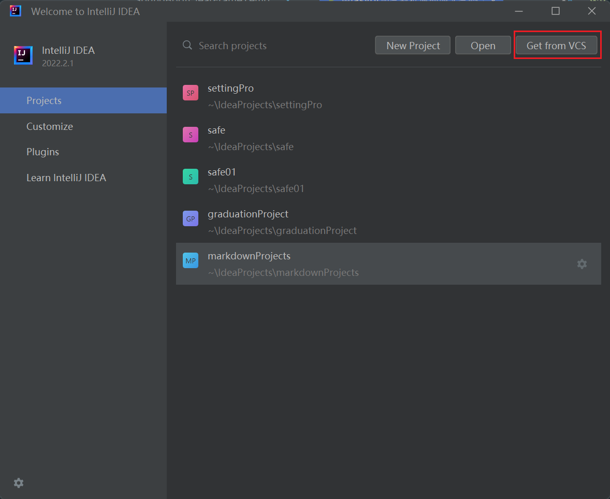
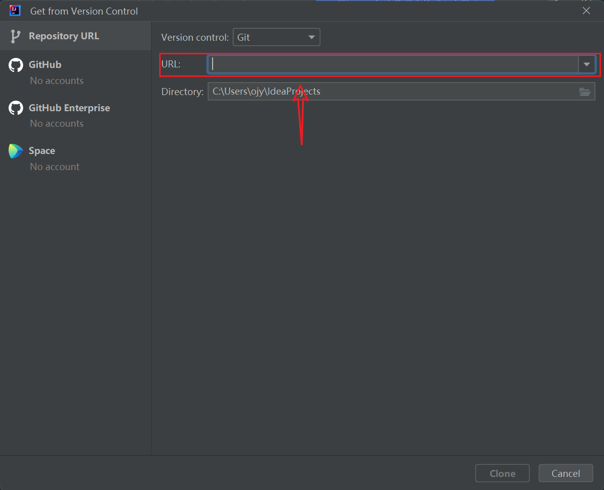

# Spring Boot[^1] Clear Frame Templates

## 这我自用的SpringBoot(也可用于Spring Cloud[^2] 项目中)的干净的框架模板

* [一，安装（主要为用git克隆）](#一，安装（主要为用git克隆）)
  * [1. 找到该项目的github网址，用以下的链接导入idea中。](#1-找到该项目的github网址，用以下的链接导入idea中。)
* [常见问题](#常见问题)

### 一，安装（主要为用git克隆）

#### 1. 找到该项目的github网址，用以下的链接导入idea中。

```http
https://github.com/GodLikesYou/SpringBootClearFrameTemplates.git
```

打开idea，点击所指示的按钮。



在进入点击按钮后的页面后，将之前已经复制的网址填写到所指的位置。并且要自己设置克隆项目在那个位置

就是所指的下面一个设置的地方就是设置克隆在哪里(也可以理解为下载到哪里)。



### 常见问题

就是如果出现无法克隆的情况的话，请先查找是不是git该软件没有安装。
